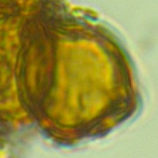
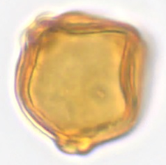
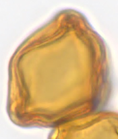
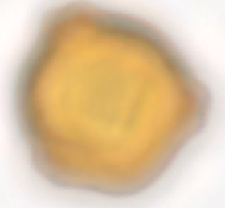
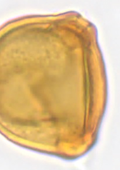
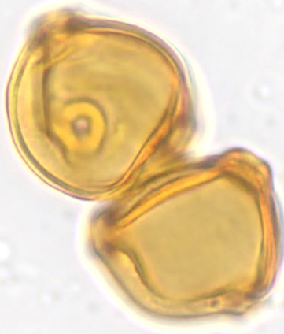
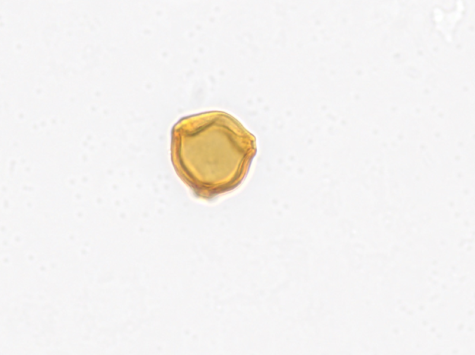

# Using Semantic Segmentation to Measure Pollen Area
This is a tool to measure the area of pollen in images. It uses a semantic segmentation model and is partly 
based on code by [M. S. Minhas](https://github.com/msminhas93/DeepLabv3FineTuning).


## Get started

To use this tool [Python 3](https://www.python.org/downloads/) is required. To install the dependencies, run the following terminal command:

```
pip install -r requirements.txt
```


## Picture Format

The pictures used should contain a single pollen in the center of the image that isn't touching the image borders. Parts of other pollen and pollution in the picture does not 
pose a problem if it's not in front of the pollen of interest.  The file format must be .png


Examples for suitable pictures:

<p float="left">
	
	
	
</p>


Examples for unsuitable pictures:

<p float="left">
	
	
	
	
</p>


## Measure Pollen Area

1. Put the images of the pollen that should be analyzed in data/images/

2. Run analyze/get_area.py

3. When the message 'Enter the scale in micrometer per pixel:' appears, type in the scale for your pictures and press enter. E.g. if one pixel in the image correspond to 0.5 μm you would enter 0.5

4. The data is saved as data/pollen_area.csv with the format: image, pixel_area, area. The masks created in the process are saved in data/masks. 


## Measure Model Performance on your dataset

1. Follow the steps to measure pollen area.

2. Put the manually segmented masks in the data/masks_manual/ folder. The masks should have a tranparent background and white when a pixel belongs to the pollen. 
The masks have to have the same file name as the associated picture. E.g. [GIMP](https://www.gimp.org/) can be used to create the masks.

3. Run analyze/area_test.py

4. A scatter plot is displayed to compare the area from the masks created by the model to ground truth. Further, 
area of the masks created manually and by the model, as well as 
the [dice coefficent](https://towardsdatascience.com/metrics-to-evaluate-your-semantic-segmentation-model-6bcb99639aa2) are saved to data/model_test.csv


## Fine-tune the Model

1. Put the training images in data/images/

2. Put the manually created masks in the data/masks_manual/ folder. The masks should have a tranparent background. The pixels that
belong to the pollen should be colored white. The masks have to have the same file name as the associated picture. E.g. [GIMP](https://www.gimp.org/) can be used to create the masks.

3. Run train_segmentation/train.py. By default, this runs for 5001 training steps. Every 100 iterations, a line chart of train and validation loss (binary cross-entropy) as well as 
the sum of squared errors of predicted area on the validation set per batch are displayed. The loss values are saved in train_segmentation/loss.csv

The model is saved once every 500 steps in train_segmentation/iteration_nr.torch. 
Note that the pretrained model may be overwritten.


